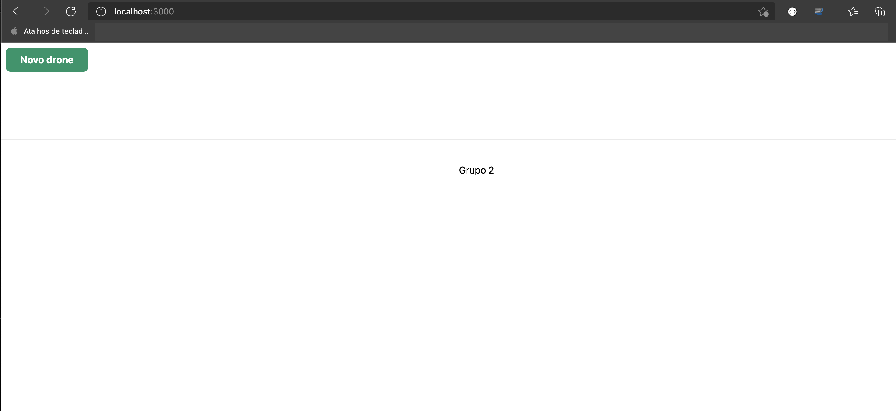
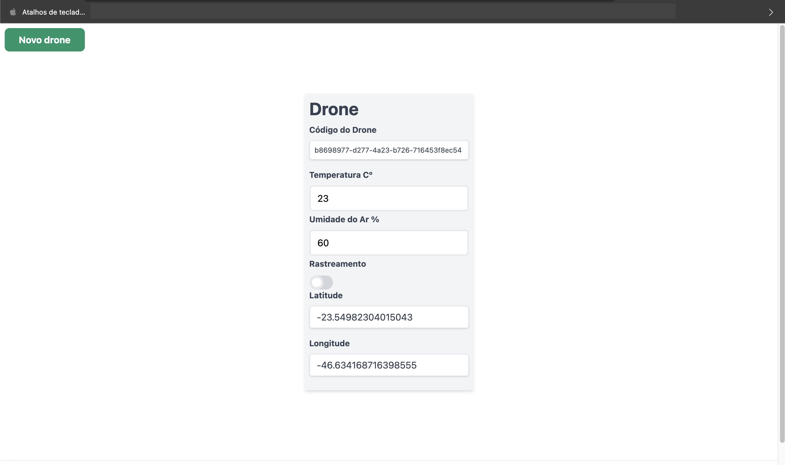
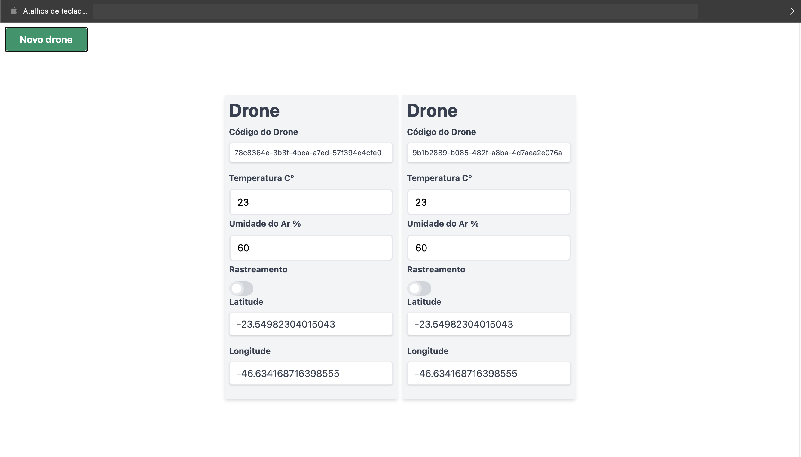

# Simulação de mapeamento de um Drone

## Descrição
<p>
Coleta os dados de temperatura e umidade que são capturadas por drones.
</p>

## Iniciando
<p>Você precisará ter o Node, Docker e o docker-compose instalados. Seguem os links abaixo caso precise:</p>

- [Nodejs](https://nodejs.org/en/download/)
- [docker](https://docs.docker.com/engine/install/)
- [docker-compose](https://docs.docker.com/compose/install/)


<p>1º passo - Faça um clone do projeto</p>
<p>2º passo - Na pasta do projeto, rode o comando descrito abaixo para criação dos containers do Kafka e Zookeeper</p>

```bash
~ docker-compose up -d
```
<p>Rode o comando <i>docker ps</i> ou <i>docker container ls</i> para ver se os containers estão ativos</p>

```bash
~ docker container ls
CONTAINER ID   IMAGE                              COMMAND                  CREATED       STATUS       PORTS                          NAMES
ce33427b578f   confluentinc/cp-kafka:latest       "/etc/confluent/dock…"   4 hours ago   Up 4 hours   0.0.0.0:9092->9092/tcp         kafka-producer-front-system_kafka_1
75b82db8bb3f   confluentinc/cp-zookeeper:latest   "/etc/confluent/dock…"   4 hours ago   Up 4 hours   2181/tcp, 2888/tcp, 3888/tcp   kafka-producer-front-system_zookeeper_1
```
<p>3º passo - Rode o comando abaixo para criar o tópico do Kafka para qual as mensagens serão enviadas</p>

```bash
~ docker-compose exec kafka kafka-topics --create --topic mapeamento-drone --partitions 1 --replication-factor 1 --if-not-exists --zookeeper zookeeper:2181 
```

<p>4º passo - Rode o comando abaixo para que o Node instale as dependencias do projeto</p>

```bash
~ npm install
```

<p>5º passo - Para buildar o projeto, rode o comando abaixo</p>

```bash
~ npm run build
```

<p>6º passo - Por fim, rode o comando abaixo para rodar a aplicação</p>

```bash
~ npm start
```

<p>Uma indicação sobre a url e a porta ira aparecer, copie a url e cole no navergador para abrir a aplicação</p>

```bash
~ ready - started server on 0.0.0.0:3000, url: http://localhost:3000
```

<h1 align="center">
  
</h1>

<p>Clique no botão "Novo Drone" para iniciar a captura das informações</p>

<h1 align="center">
  
</h1>

<p>Clique novamente no botão para adicionar mais um drone</p>

<h1 align="center">
  
</h1>

#


This is a [Next.js](https://nextjs.org/) project bootstrapped with [`create-next-app`](https://github.com/vercel/next.js/tree/canary/packages/create-next-app).